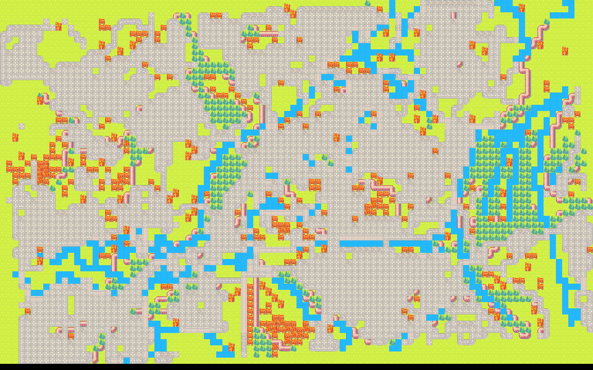
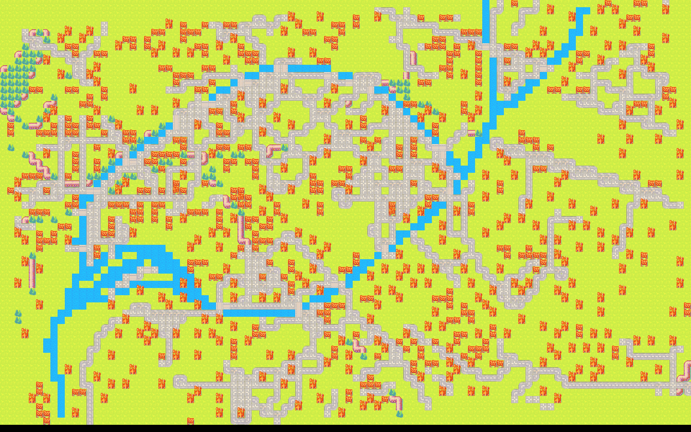

# RealMap
Create video game map using real data from OpenStreetMap

## Todo
* Add a 4-to-8-connectivity algorithm for railways, roads and waterways
* Create a GUI for real time map creation and edition

## Results
### Main example
#### Initial exctracted Shapefile

#### Pre-processed Shapefile

#### Result

### Other results
Those example use Strasbourg maps with different scale and size of Shapefile. The example are based on the
[08542839293c5acc23bf157694516e255fb2deb6](https://github.com/Yt-trium/RealMap/tree/08542839293c5acc23bf157694516e255fb2deb6)
version of RealMap.
The purpose of this section is to show the limit of RealMap when used on dense, small or large Shapefile.

#### Strasbourg L

#### Strasbourg S

## How it works
To create a Map, we separate the real world into cells. Each cell contain a flag for every type of element which exists
inside the Shapefile. We use a simple homothetic transformation to place the Shapefile geometric elements inside our
cells. Then, we create a map depending of the flags. If no flag is set, the cell is considered as a "nature" cell.
