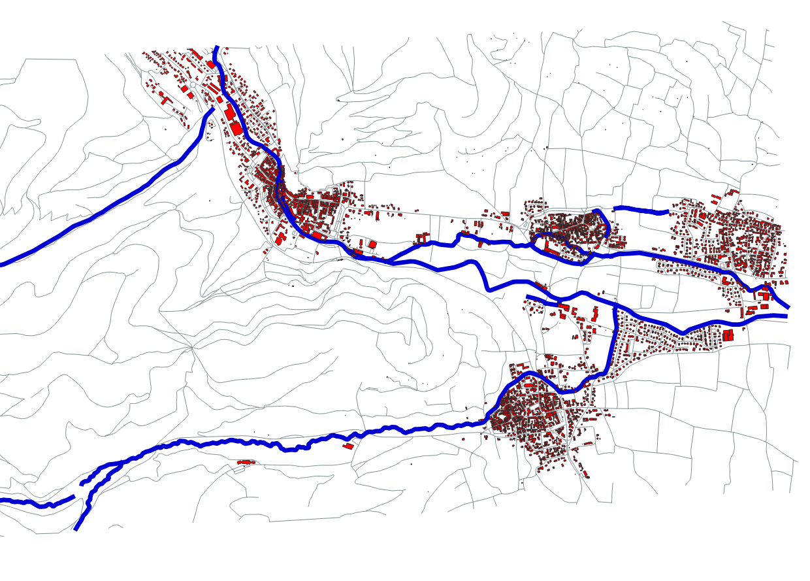
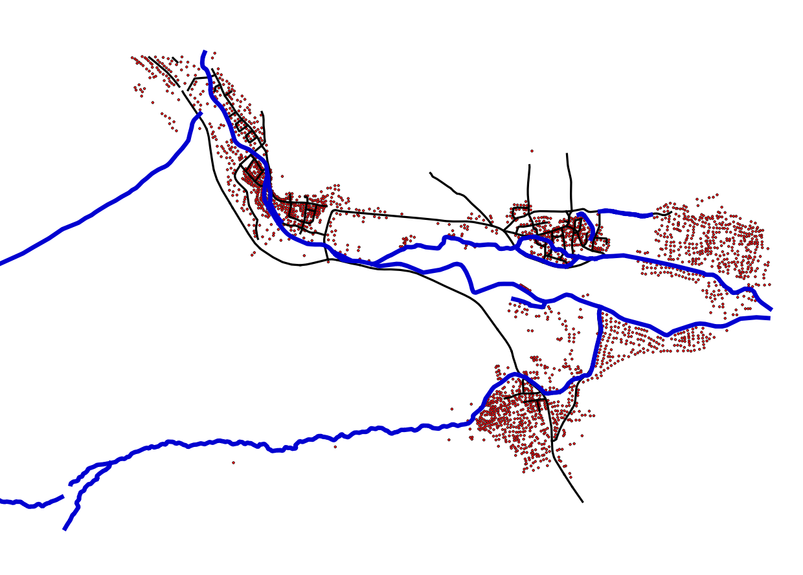
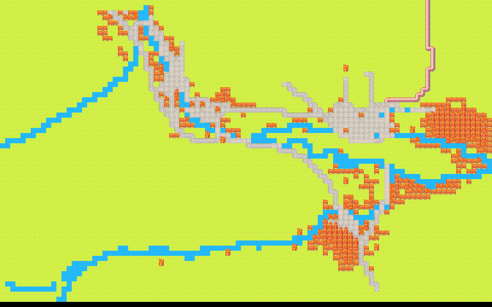

# RealMap
Create video game map using real data from OpenStreetMap

## Results
### Initial exctracted Shapefile

### Pre-processed Shapefile

### Result

## How it works
To create a Map, we separate the real world into cells. Each cell contain a flag for every type of element which exists
inside the Shapefile. We use a simple homothetic transformation to place the Shapefile geometric elements inside our
cells. Then, we create a map depending of the flags. If no flag is set, the cell is considered as a "nature" cell.
